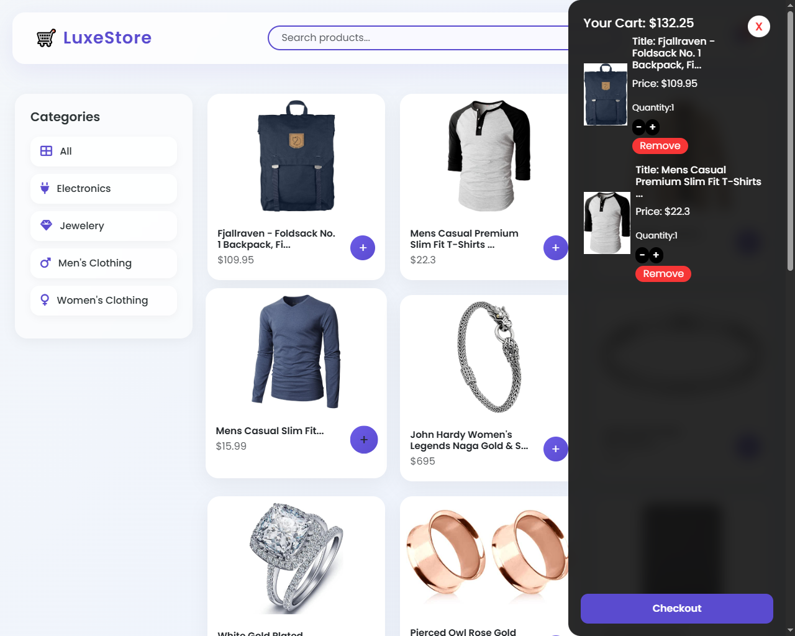

🛒 FakeStore Frontend Store
A clean frontend e-commerce store built using the FakeStore API.
Users can browse products, filter by categories, and view details.

🚀 Features
Dynamic Products: Data fetched from FakeStore API

Product Cards: Show image, title, price & description

Category Filter: Easily filter products

Responsive Design: Works on mobile & desktop

Pure Vanilla JavaScript: No frameworks

🌐 Live Demo
👉 View the live project here:https://stirring-pixie-2d6de9.netlify.app/

## 📷 Screenshots

🛠️ Tech Stack
HTML5 – Structure

CSS3 – Styling

JavaScript (ES6) – Functionality

FakeStore API – Product data

🌐 API Used
GET /products – Fetch all products

GET /products/categories – Fetch product categories

More details: FakeStore API Docs

🤝 Contributing
Contributions are welcome!
Please open an issue first to discuss what you'd like to change.

📝 License
This project is open-source and available under the MIT License.
